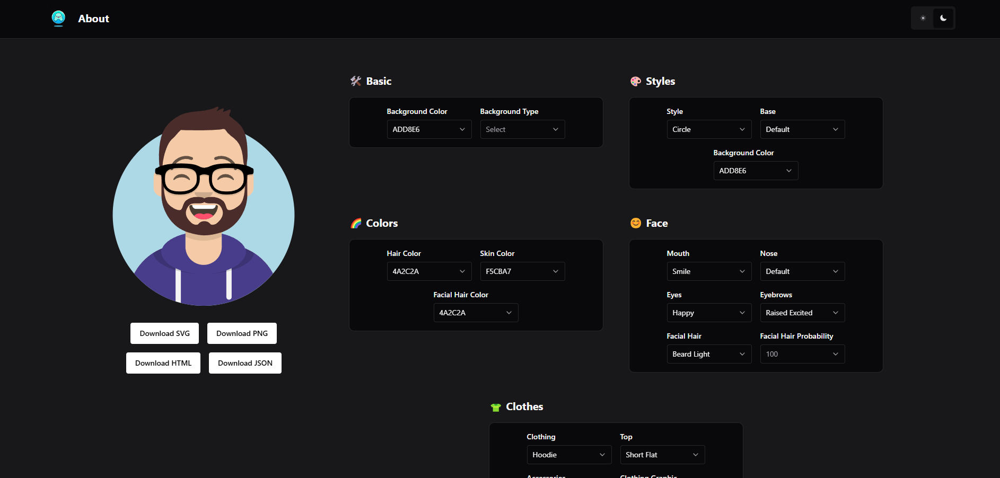
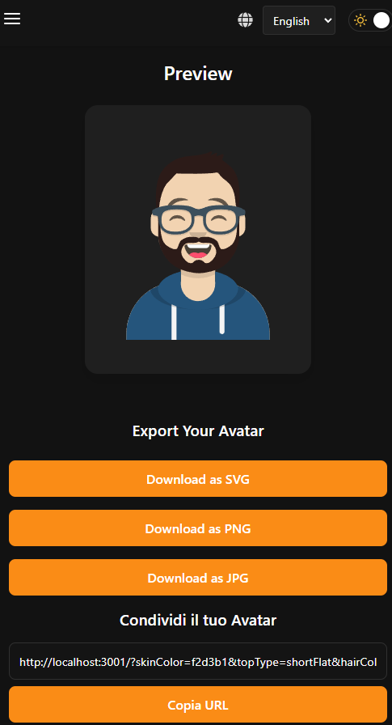

# Avatar Maker

<p align="center">
  
</p>

[](https://reactjs.org/)
[](https://www.typescriptlang.org/)
[](https://vitejs.dev/)
[](https://styled-components.com/)
[](https://www.i18next.com/)
[](https://www.docker.com/)
[](LICENSE)

A customizable avatar creation tool that allows users to generate and download unique avatars with multilingual support.

<p align="center">
   <div style="display: flex; justify-content: center; align-items: center; gap: 10px;">
      
      
   </div>
</p>

## Features

- 🎭 **Customizable Avatars**: Create personalized avatars with various options for features, colors, and styles
- 🌐 **Multilingual Support**: Fully localized in Italian, English, French, Spanish, Chinese, and Japanese
- 🔄 **State Management**: Redux-based state persistence with URL and localStorage synchronization
- 💾 **Multiple Export Formats**: Download your avatar in SVG, PNG, and JPG formats
- 🔗 **Shareable Links**: Generate and share links that preserve your avatar customizations
- 🎨 **Theme Support**: Light and dark mode with customizable accent colors
- 📱 **Responsive Design**: Optimized for desktop, tablet, and mobile devices
- 🐳 **Docker Support**: Production-ready Docker setup for easy deployment

## Getting Started

### Prerequisites

- Node.js 20.x or higher
- npm or yarn
- Docker (optional, for containerized deployment)

### Installation

1. Clone the repository:

```bash
git clone https://github.com/5h1ngy/fe-react-avatar-maker.git
cd fe-react-avatar-maker
```

2. Install dependencies:

```bash
npm install
# or
yarn
```

3. Start the development server:

```bash
# Standard development mode
npm run start:dev
# or with mock API enabled
npm run start:mock
```

4. Open your browser and navigate to `http://localhost:5173`

## Project Structure

```
bl-custom-fe-react/
├── public/               # Static assets
├── src/
│   ├── components/       # Reusable components
│   │   ├── ui/           # Base UI components
│   │   └── ...           # Feature-specific components
│   ├── layouts/          # Layout components
│   ├── pages/            # Page components
│   ├── providers/        # Context providers
│   ├── services/         # API services
│   │   ├── api/          # Real API services
│   │   └── mock/         # Mock implementations
│   ├── store/            # Redux store setup
│   │   └── slices/       # Redux slices
│   ├── types/            # TypeScript type definitions
│   ├── utils/            # Utility functions
│   ├── App.tsx           # Main App component
│   └── main.tsx          # Entry point
├── .env.development      # Development environment variables
├── .env.mock             # Mock environment variables
├── .env.prod             # Production environment variables
├── package.json          # Dependencies and scripts
├── tsconfig.json         # TypeScript configuration
└── vite.config.ts        # Vite configuration
```

## Configuration

### Environment Variables

The boilerplate includes three environment files:

- `.env.development` - Used during local development
- `.env.mock` - Used when running in mock mode
- `.env.prod` - Used for production builds

You can modify these files to set API URLs, feature flags, and other environment-specific settings.

### Mock Mode

Mock mode allows you to develop without a backend by simulating API responses. 

To enable mock mode:

1. Ensure the `VITE_APP_MOCK_ENABLED` flag is set to `true` in `.env.mock`
2. Start the application in mock mode: `npm run start:mock`

Mock implementations are located in `src/services/mock/` and can be customized as needed.

## Theming

The boilerplate includes a comprehensive theming system with:

### Light and Dark Modes

The application automatically respects the user's system preference for light or dark mode, with an option to override.

Theme mode can be toggled using the `ThemeSwitcher` component or via Redux actions:

```javascript
import { toggleThemeMode } from '@/store/slices/themeSlice';
import { useDispatch } from 'react-redux';

const dispatch = useDispatch();
dispatch(toggleThemeMode());
```

### Accent Colors

Users can customize the accent color of the application. Available colors are defined in the theme configuration.

To change the accent color:

```javascript
import { setAccentColor } from '@/store/slices/themeSlice';
import { useDispatch } from 'react-redux';

const dispatch = useDispatch();
dispatch(setAccentColor('blue')); // 'blue', 'purple', 'teal', etc.
```

## Available Scripts

- `npm run start:dev` - Start development server
- `npm run start:mock` - Start development server with mock API enabled
- `npm run build:prod` - Build for production
- `npm run preview:prod` - Preview production build locally
- `npm run clean` - Remove dist and node_modules directories
- `npm run docker:build` - Build Docker image
- `npm run docker:run` - Run Docker container (after building)
- `npm run docker:build-run` - Build and run Docker container in one command
- `npm run docker:push` - Tag and push Docker image to registry

## Docker Deployment

This project includes a ready-to-use Docker setup for production deployment with Nginx as a web server.

### Building and Running with Docker

1. Build the Docker image:

```bash
npm run docker:build
# or directly with Docker
docker build -t bl-custom-fe-react:latest .
```

2. Run the container:

```bash
npm run docker:run
# or directly with Docker
docker run -p 8080:80 bl-custom-fe-react:latest
```

3. Access the application at `http://localhost:8080`

### Using Docker Compose

You can also use Docker Compose for a more declarative approach:

```bash
docker-compose up -d
```

This will build the image if it doesn't exist and start the container in detached mode.

### Docker Image Details

The Docker setup uses a multi-stage build process:

1. **Build Stage**: Uses Node.js to build the React application
2. **Production Stage**: Uses Nginx to serve the built static files

Benefits of this approach:
- **Smaller image size**: Final image only contains what's needed to run the application
- **Better performance**: Nginx is optimized for serving static content
- **Enhanced security**: No build tools or source code in the production image

The Nginx configuration includes:
- Gzip compression for better performance
- Cache control headers for static assets
- Proper handling of SPA routing
- Security headers for better protection

## Contributing

1. Fork the repository
2. Create your feature branch: `git checkout -b feature/my-new-feature`
3. Commit your changes: `git commit -am 'Add some feature'`
4. Push to the branch: `git push origin feature/my-new-feature`
5. Submit a pull request

## License

This project is licensed under the MIT License - see the LICENSE file for details.
