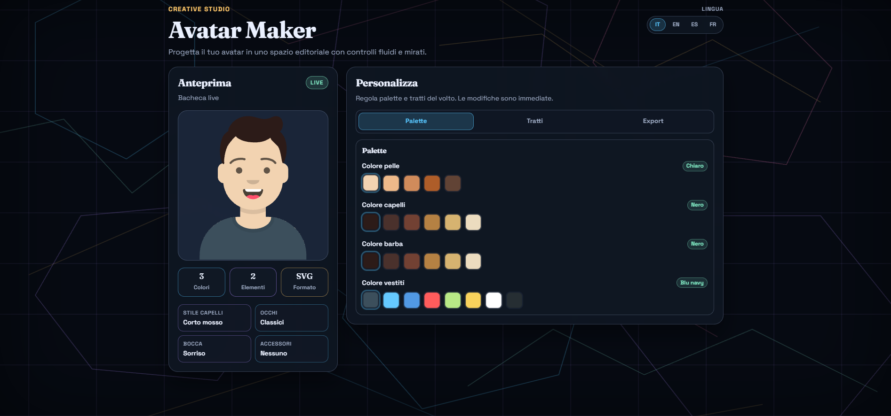

# 🎨 Avatar Maker

> Create and customize avatars with React, Redux Toolkit, i18n, GSAP, and a **simple modular structure**.

## Live Preview

- https://d4v3-rm.github.io/fe-react-avatar-maker/



## ✨ Overview

`fe-react-avatar-maker` is a frontend project built with:

- ⚛️ React + TypeScript + Vite
- 🧠 Redux Toolkit for state management
- 🌍 i18next / react-i18next for localization (`it`, `en`, `es`, `fr`)
- 🎞️ GSAP for smooth UI interactions
- 🎨 Sass split by component (no monolithic stylesheet)

The current architecture is intentionally lightweight and easier to maintain than a layered enterprise scaffold.

---

## 🛠️ Tech Stack

| Area          | Tools                                    |
| ------------- | ---------------------------------------- |
| Frontend      | React 18, TypeScript, Vite               |
| State         | Redux Toolkit, React Redux               |
| Avatar engine | DiceBear Core + Collection (`avataaars`) |
| Localization  | i18next, react-i18next                   |
| Motion        | GSAP                                     |
| Styling       | Sass (component-level)                   |
| Quality       | ESLint, Prettier                         |

---

## 🚀 Quick Start

### 1. Install dependencies

```bash
npm install
```

### 2. Run in development

```bash
npm run dev
```

### 3. Build for production

```bash
npm run build
```

### 4. Preview production build

```bash
npm run preview
```

Live preview:

- https://d4v3-rm.github.io/fe-react-avatar-maker/

---

## 📜 Scripts

| Command                | Description                   |
| ---------------------- | ----------------------------- |
| `npm run dev`          | Start Vite dev server         |
| `npm run build`        | Type-check + production build |
| `npm run preview`      | Preview production build      |
| `npm run lint`         | Run ESLint                    |
| `npm run lint:fix`     | Fix lint issues automatically |
| `npm run format`       | Format with Prettier          |
| `npm run format:check` | Check formatting              |

---

## 🧱 Simplified Project Structure

```text
src/
  App.tsx
  main.tsx

  components/
    AvatarPage/
    AvatarPreview/
    AvatarControls/
    LanguageSwitcher/

  domain/
    avatar/
      buildAvatar.ts
      avatarDefaults.ts
      avatar.types.ts
      options/

  store/
    index.ts
    hooks.ts
    avatar/

  i18n/
    i18n.ts
    locales/

  hooks/
    useRevealAnimation.ts
    useInteractiveMotion.ts
    usePulseOnChange.ts
    useMotionSafe.ts

  styles/
    globals.scss
```

### Why this structure?

- ✅ Clear separation by purpose (components, domain, store, i18n, hooks)
- ✅ Easy navigation and onboarding
- ✅ Keeps files small and focused
- ✅ Avoids monolithic components and monolithic styles

---

## 🧩 Types Convention

Types are split into dedicated `*.types.ts` files, for example:

- `src/components/AvatarControls/AvatarControls.types.ts`
- `src/domain/avatar/avatar.types.ts`
- `src/store/avatar/avatar.types.ts`

---

## 🎨 Styling Convention

- Global tokens and base rules are in `src/styles/globals.scss`
- Each component has its own `.scss` file next to the component
- No single massive style file for the whole app

---

## 🌍 Supported Languages

The app is localized only in:

- 🇮🇹 Italiano (`it`)
- 🇬🇧 English (`en`)
- 🇪🇸 Español (`es`)
- 🇫🇷 Français (`fr`)

Translations live in:

```text
src/i18n/locales/en.json
src/i18n/locales/it.json
src/i18n/locales/es.json
src/i18n/locales/fr.json
```

---

## 📄 License

MIT License.  
See [`LICENSE`](LICENSE).
