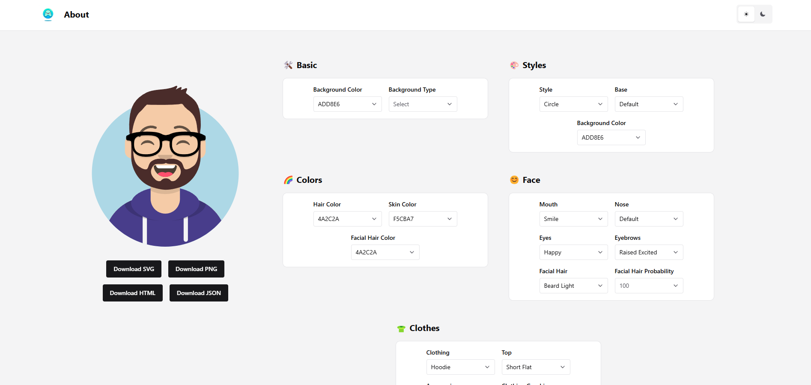
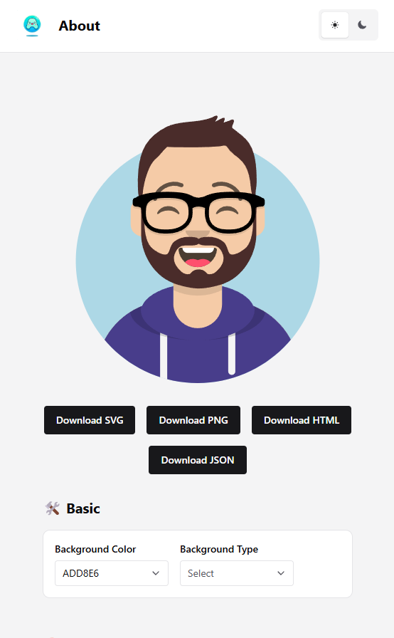

# **fe-react-avatar-maker**

<p align="center">
  
</p>

[](./LICENSE)
[](#)


A modern React application built with TypeScript and Chakra UI to create and manage avatars in an intuitive and interactive way. The app is focused on performance, accessibility, and maintainability.

<p align="center">
   <div style="display: flex; justify-content: center; align-items: center; gap: 10px;">
      
      
      
      
   </div>
</p>

## **Table of Contents**

- [Introduction](#introduction)
- [Features](#features)
- [Requirements](#requirements)
- [Installation](#installation)
- [Usage](#usage)
- [Project Structure](#project-structure)
- [Key Dependencies](#key-dependencies)
- [Testing](#testing)
- [License](#license)
- [Contributing](#contributing)
- [Contact](#contact)

## **Introduction**

**fe-react-avatar-maker** is designed to provide a seamless user experience for creating and customizing avatars. The app leverages **React**, **TypeScript**, and **Redux Toolkit** to ensure scalability, maintainability, and robust state management.

## **Features**

- ✅ Create custom avatars with advanced design options.  
- ✅ Dynamic theming with **next-themes** and **Chakra UI**.  
- ✅ Integrated state management using **Redux Toolkit**.  
- ✅ Type-safe and performant with **TypeScript**.  
- ✅ Modular routing powered by **React Router v7**.  
- ✅ Engaging animations with **GSAP**.  
- ✅ Built-in Storybook for component documentation and testing.

## **Requirements**

Ensure the following are installed on your system:

- **Node.js**: `>= 20.18.0`
- **Yarn**: `>= 4.5.1`

## **Installation**

### Steps

1. Clone the repository:
   ```bash
   git clone https://github.com/5h1ngy/fe-react-avatar-maker.git
   cd fe-react-avatar-maker
   ```

2. Install dependencies:
   ```bash
   yarn install
   ```

3. Start the development server:
   ```bash
   yarn dev
   ```

For a production build:
```bash
yarn build
yarn start
```

## **Usage**

### Core Features:
- **Custom Avatar Creation**: Design unique avatars with an intuitive interface.
- **Dynamic Theming**: Switch between light and dark themes with **next-themes** and **Chakra UI**.
- **State Management**: Manage data seamlessly using **Redux Toolkit**.

This project serves as a comprehensive tool for applications needing personalized avatars with responsive design.

## **Project Structure**

```plaintext
src/
├── assets/          # Static assets (images, icons, etc.)
├── components/      # Reusable components
├── pages/           # Page-level components
├── store/           # State management (e.g., Redux slices)
├── routes/          # Routing configurations
├── styles/          # Global and component styles
├── App.tsx          # Main app entry point
└── main.tsx         # Application bootstrap file
```

## **Key Dependencies**

- **React**: Core library for building user interfaces.
- **Chakra UI**: Provides a sleek and accessible design system.
- **Redux Toolkit**: Manages state efficiently.
- **GSAP**: Powers animations for a dynamic user experience.
- **React Router DOM**: Handles routing seamlessly.
- **TypeScript**: Ensures type safety and scalability.

For detailed dependency versions, see the [package.json](./package.json).

## **Testing**

Use **Storybook** to test and document components interactively. Start Storybook:

```bash
yarn storybook
```

## **License**

This project is licensed under the [MIT License](./LICENSE).

## **Contact**

- **Repository**: [https://github.com/5h1ngy/fe-react-avatar-maker](https://github.com/5h1ngy/fe-react-avatar-maker)  
- **Author**: [5h1ngy](https://github.com/5h1ngy)  