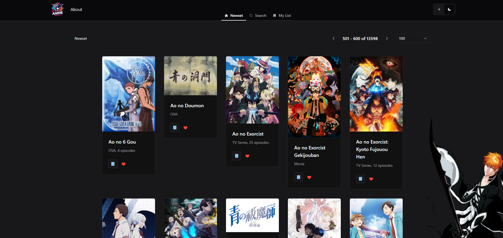

# **fe-react-anime-watch**

<p align="center">
  
</p>


> **Version**: `1.0.0`

A modern React application to track and manage your watched anime. Built with Chakra UI for a sleek and accessible design system, Redux Toolkit for robust state management, and Storybook for component documentation and testing. Developed using TypeScript and Vite for optimal performance and scalability.

 <!-- Placeholder: Replace with actual image -->

## **Features**

✅ Track and manage anime you have watched.  
✅ Search for anime by title and filter results.  
✅ Create a custom anime watchlist.  
✅ Pagination for anime results.  
✅ Dynamic theming with **next-themes** and **Chakra UI**.  
✅ Integrated state management using **Redux Toolkit**.  
✅ Type-safe and performant with **TypeScript**.  
✅ Modular, scalable routing powered by **React Router v7**.  
✅ Animations with **GSAP** for engaging user experience.  
✅ Built-in Storybook for documenting and testing components.

## **Installation**

### Prerequisites

Ensure you have the following installed:

- **Node.js**: `>= 20.18.0`
- **Yarn**: `>= 4.5.1`

### Installation Steps

1. **Clone the repository**:

   ```bash
   git clone https://github.com/5h1ngy/fe-react-anime-watch.git
   cd fe-react-anime-watch
   ```

2. **Install dependencies**:

   ```bash
   yarn install
   ```

3. **Run the application**:

   #### Development Mode:
   ```bash
   yarn dev
   ```

   #### Build and Preview for Production:
   ```bash
   yarn build
   yarn start
   ```

## **Usage**

The application allows users to explore a vast library of anime, create watchlists, and access details about their favorite shows.

### Features at a Glance:
- **Search**: Locate anime by title or tags.
- **Pagination**: Browse results efficiently with pagination.
- **Dynamic Theming**: Switch between light and dark themes.
- **Watchlist**: Save and manage your favorite anime.

### API Integration
The app communicates with a backend (e.g., `be-node-anime-watch`) for fetching anime data.

### Deployment
The app is built using **Vite** for blazing-fast performance. For deployment, use:

```bash
yarn build
```

## **Project Structure**

```plaintext
src/
├── assets/          # Static assets (e.g., images, icons)
├── components/      # Reusable UI components (Cards, Buttons, etc.)
├── pages/           # Page-level components (Home, Details)
├── store/           # Redux Toolkit slices and state management
├── routes/          # Route definitions and loaders
├── providers/       # Application providers (Theme, Helmet)
├── hocs/            # Higher-order components (e.g., withRouter)
├── styles/          # Global and theme-specific styles
├── App.tsx          # Main application component
└── main.tsx         # Entry point for the app
```

## **Key Dependencies**

### Runtime
- **React**: Core library for building user interfaces.
- **Chakra UI**: Component library for a modern design system.
- **Redux Toolkit**: State management with minimal boilerplate.
- **GSAP**: Animation library for scroll-based and interactive animations.
- **React Router DOM**: Routing solution with loader and data management.
- **next-themes**: Simple theme management.

### Development
- **TypeScript**: Typed JavaScript for scalable and maintainable code.
- **Storybook**: Component library documentation and testing.
- **Vite**: Development server and bundler.

## **Animation**

Animations are powered by **GSAP**. Example use cases:
- Cards animate into view on scroll using `ScrollTrigger`.
- Smooth transitions between pages.

## **Testing**

Storybook provides an interactive environment for testing individual components. To start Storybook:

```bash
yarn storybook
```

## **License**

This project is licensed under the MIT License. See the [LICENSE](LICENSE) file for full details.

## **Author**

Project created by [5h1ngy](https://github.com/5h1ngy).